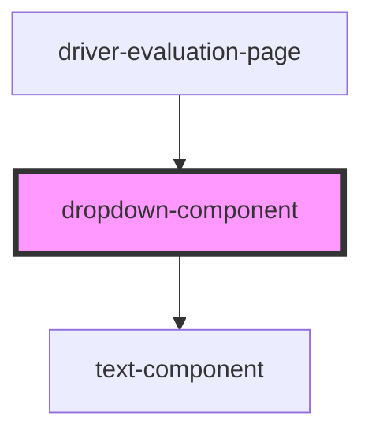

# dropdown-component

<!-- Auto Generated Below -->

## Properties

| Property               | Attribute | Description              | Type                                  | Default       |
| ---------------------- | --------- | ------------------------ | ------------------------------------- | ------------- |
| `heading`              | `heading` | Title                    | `string`                              | `'Select...'` |
| `options` _(required)_ | --        | List of dropdown options | `{ label: string; value: string; }[]` | `undefined`   |

## Events

| Event             | Description                                     | Type               |
| ----------------- | ----------------------------------------------- | ------------------ |
| `dropdownChanged` | Emitts new value whenever an option is selected | `CustomEvent<any>` |

## Methods

### `reset() => Promise<void>`

Resets dropdown

#### Returns

Type: `Promise<void>`

## Dependencies

### Used by

 - [driver-evaluation-page](../../pages/driver-evaluation-page)

### Depends on

- [text-component](../text-component)

### Graph

----------------------------------------------

*Built with [StencilJS](https://stenciljs.com/)*
