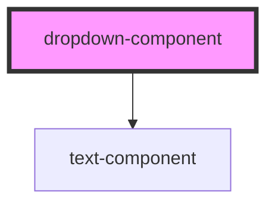

# dropdown-component

<!-- Auto Generated Below -->

## Properties

| Property               | Attribute | Description              | Type                                  | Default       |
| ---------------------- | --------- | ------------------------ | ------------------------------------- | ------------- |
| `heading`              | `heading` | Title                    | `string`                              | `'Select...'` |
| `options` _(required)_ | --        | List of dropdown options | `{ label: string; value: string; }[]` | `undefined`   |

## Dependencies

### Depends on

- [text-component](../text-component)

### Graph

----------------------------------------------

*Built with [StencilJS](https://stenciljs.com/)*
