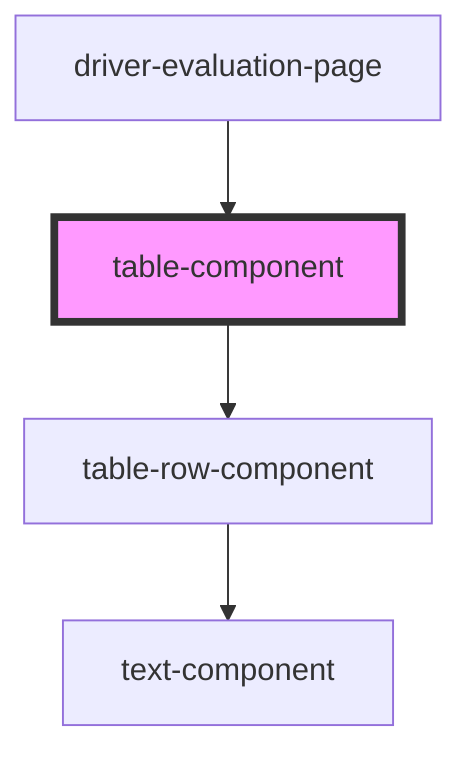

# table-row-component

<!-- Auto Generated Below -->

## Properties

| Property                 | Attribute       | Description                                                                                                              | Type                     | Default               |
| ------------------------ | --------------- | ------------------------------------------------------------------------------------------------------------------------ | ------------------------ | --------------------- |
| `emptyMessage`           | `empty-message` | Message to display if `rows` is empty                                                                                    | `string`                 | `'No entries found.'` |
| `headerRow` _(required)_ | --              | Header cell contents                                                                                                     | `string[]`               | `undefined`           |
| `rows`                   | --              | Rows of cell contents                                                                                                    | `(string \| number)[][]` | `undefined`           |
| `size`                   | `size`          | 'shrink' will cause the table to shrink to the size of its children rows, while 'full' will fill up all available space. | `"full" \| "shrink"`     | `'shrink'`            |

## Dependencies

### Used by

-   [driver-evaluation-page](../../pages/driver-evaluation-page)

### Depends on

-   [table-row-component](../table-row-component)

### Graph

---

_Built with [StencilJS](https://stenciljs.com/)_
