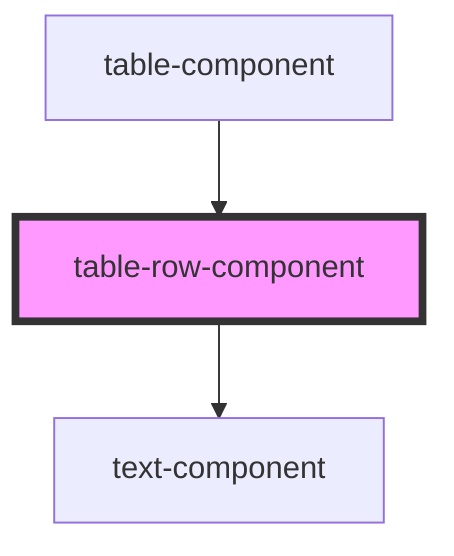

# table-row-component

<!-- Auto Generated Below -->

## Properties

| Property             | Attribute   | Description                                                                                                                                              | Type                   | Default     |
| -------------------- | ----------- | -------------------------------------------------------------------------------------------------------------------------------------------------------- | ---------------------- | ----------- |
| `cells` _(required)_ | --          | Cell contents                                                                                                                                            | `(string \| number)[]` | `undefined` |
| `isHeader`           | `is-header` | Whether to render a header row or standard row                                                                                                           | `boolean`              | `false`     |
| `size`               | `size`      | 'shrink' will cause each cell to take a fixed value, while 'full' will cause the row to fill up all available space, distributing it evenly among cells. | `"full" \| "shrink"`   | `'shrink'`  |

## Dependencies

### Used by

 - [table-component](../table-component)

### Depends on

- [text-component](../text-component)

### Graph

----------------------------------------------

*Built with [StencilJS](https://stenciljs.com/)*
