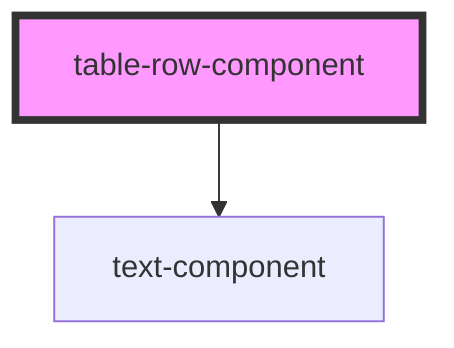

# table-row-component

<!-- Auto Generated Below -->

## Properties

| Property             | Attribute   | Description                                    | Type       | Default     |
| -------------------- | ----------- | ---------------------------------------------- | ---------- | ----------- |
| `cells` _(required)_ | --          | Cell contents                                  | `string[]` | `undefined` |
| `isHeader`           | `is-header` | Whether to render a header row or standard row | `boolean`  | `false`     |

## Dependencies

### Depends on

- [text-component](../text-component)

### Graph

----------------------------------------------

*Built with [StencilJS](https://stenciljs.com/)*
