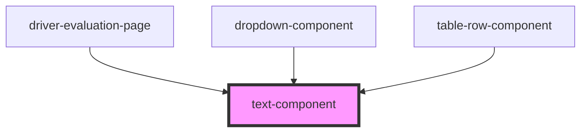

# text-component

<!-- Auto Generated Below -->

## Properties

| Property     | Attribute    | Description                                     | Type                               | Default       |
| ------------ | ------------ | ----------------------------------------------- | ---------------------------------- | ------------- |
| `appearance` | `appearance` | Determines the appearance of the text           | `"link" \| "paragraph" \| "title"` | `'paragraph'` |
| `size`       | `size`       | Determines the font size                        | `"l" \| "m" \| "s"`                | `'m'`         |
| `tag`        | `tag`        | HTML tag to render as                           | `string`                           | `'p'`         |
| `theme`      | `theme`      | Whether the text will have dark or light colors | `"dark" \| "light"`                | `'dark'`      |

## Dependencies

### Used by

-   [driver-evaluation-page](../../pages/driver-evaluation-page)
-   [dropdown-component](../dropdown-component)
-   [table-row-component](../table-row-component)

### Graph

---

_Built with [StencilJS](https://stenciljs.com/)_
